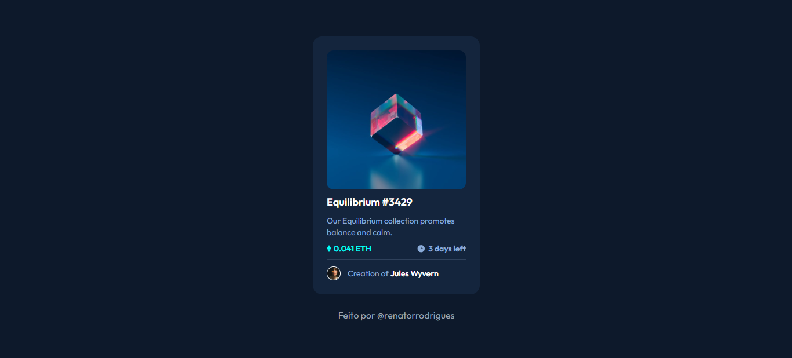

# Frontend Mentor - NFT preview card component solution

This is a solution to the [NFT preview card component challenge on Frontend Mentor](https://www.frontendmentor.io/challenges/nft-preview-card-component-SbdUL_w0U). Frontend Mentor challenges help you improve your coding skills by building realistic projects.

## Table of contents

- [Overview](#overview)
  - [The challenge](#the-challenge)
  - [Screenshot](#screenshot)
  - [Links](#links)
  - [Built with](#built-with)
- [Author](#author)

## Overview

### The challenge

Users should be able to:

- View the optimal layout depending on their device's screen size
- See hover states for interactive elements

### Screenshot

### Links

- Solution URL: [Link](https://www.frontendmentor.io/solutions/responsive-nft-preview-M0HD97lLoc)
- Live Site URL: [Vercel](https://nft-preview-card-sage-five.vercel.app/)

### Built with

- Mobile-first workflow
- Semantic HTML5 markup
- CSS custom properties
- Flexbox
- [React](https://reactjs.org/) - JS library
- [Vite.js](https://vitejs.dev/) - React framework
- [Tailwindcss](https://tailwindcss.com/) - Css framework

## Author

- Linkedin - [Renato Rocha](https://www.linkedin.com/in/renato-rrodrigues/)
- Frontend Mentor - [@renatorrocha](https://www.frontendmentor.io/profile/renatorrocha)
